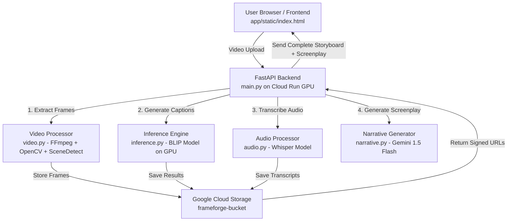

# 🧩 FrameForge - System Architecture

## Overview

FrameForge is a **GPU-accelerated AI system** built on **Google Cloud Run** that automatically extracts video frames, generates scene captions, and creates professional screenplay format output.
It combines serverless infrastructure with CUDA-powered model inference for comprehensive video understanding and narrative analysis.

---

## 🏗️ High-Level Architecture



---

## 🔧 Component Details

### 1. Frontend Layer (`app/static/index.html`)
- **Technology**: Vanilla JavaScript + HTML5 + Tailwind CSS
- **Functionality**:
  - Video file upload interface
  - Configuration options (scene detection, audio analysis, narrative method)
  - Real-time progress indicators
  - Storyboard visualization with frame thumbnails
  - Screenplay format display

### 2. Backend Layer (`FastAPI`)

#### 2.1 Main API (`app/main.py`)
- **Framework**: FastAPI + Uvicorn
- **Key Endpoints**:
  - `GET /` - Serves frontend
  - `GET /health` - Health check with model status
  - `POST /upload` - Main video processing endpoint
- **Features**:
  - CORS middleware for cross-origin requests
  - Static file serving
  - Async video processing pipeline
  - Error handling and validation

#### 2.2 Video Processing (`app/video.py`)
- **Libraries**: FFmpeg, OpenCV, SceneDetect
- **Capabilities**:
  - Fixed-interval frame extraction (customizable FPS)
  - Intelligent scene detection (threshold-based)
  - Video metadata extraction (duration, resolution)
  - Frame timestamp tracking

#### 2.3 AI Inference (`app/inference.py`)
- **Model**: Salesforce/blip-image-captioning-base
- **Hardware**: NVIDIA L4 GPU with CUDA 12.1
- **Framework**: PyTorch + Transformers
- **Process**:
  - Model loaded at startup (warm-up)
  - Batch processing for efficiency
  - GPU-accelerated inference
  - Caption generation for each frame

#### 2.4 Audio Processing (`app/audio.py`)
- **Model**: OpenAI Whisper (base/small/medium)
- **Features**:
  - Audio extraction from video
  - Speech-to-text transcription
  - Language detection
  - Dialogue alignment with timestamps
  - Integration with frame data

#### 2.5 Narrative Generation (`app/narrative.py`)
- **Model**: Google Gemini 1.5 Flash
- **Output Format**:
  - **Logline**: One-sentence story summary
  - **Synopsis**: Detailed narrative breakdown
  - **Screenplay**: Professional INT/EXT scene formatting
  - **Scene Breakdown**: Timestamped analysis
  - **Visual Style**: Cinematography description
  - **Themes**: Story themes and messages
- **Methods**:
  - Caption-based analysis (fast, recommended)
  - Video-based analysis (slower, more accurate)

#### 2.6 Storage Integration (`app/storage.py`)
- **Service**: Google Cloud Storage (GCS)
- **Functionality**:
  - Upload frames and videos to GCS bucket
  - Generate signed URLs for secure access
  - Organize assets by video ID
  - Automatic cleanup support

### 3. Infrastructure Layer

#### Google Cloud Run (GPU)
- **Region**: europe-west4
- **GPU**: 1× NVIDIA L4
- **Memory**: 16 GB
- **CPU**: 4 vCPUs
- **Concurrency**: 1 (for GPU isolation)
- **Timeout**: 900s (15 minutes)
- **Container**: CUDA 12.1 base image

#### Google Cloud Storage
- **Bucket**: frameforge-bucket
- **Structure**:
  ```
  {video_id}/
  ├─ input/
  │  └─ original_video.mp4
  └─ frames/
     ├─ frame_001_0.0s.jpg
     ├─ frame_002_2.0s.jpg
     └─ ...
  ```
- **Access**: Signed URLs with expiration

---

## 📊 Data Flow

### Video Processing Pipeline

1. **Upload Phase**
   - User uploads video via web UI
   - FastAPI receives multipart/form-data
   - Video saved to temporary directory
   - Validation (size, format, duration)

2. **Extraction Phase**
   - Video analysis with FFmpeg
   - Scene detection or fixed-interval extraction
   - Frames saved as JPG images
   - Metadata collection (timestamps, scene numbers)

3. **AI Processing Phase**
   - Frames uploaded to GCS
   - BLIP model generates captions (GPU)
   - Optional: Whisper transcribes audio
   - Optional: Gemini generates screenplay

4. **Response Phase**
   - Generate signed URLs for all assets
   - Compile storyboard JSON
   - Return complete response to frontend

### Request/Response Format

**Request:**
```
POST /upload
Content-Type: multipart/form-data

- file: video file
- interval_seconds: 2.0
- use_scene_detection: true
- enable_audio_analysis: false
- enable_narrative_analysis: true
- narrative_method: "captions"
```

**Response:**
```json
{
  "video_id": "video_abc123",
  "total_frames": 10,
  "video_duration": 20.5,
  "extraction_method": "scene_detection",
  "frames": [
    {
      "frame_number": 1,
      "timestamp": 0.0,
      "frame_url": "https://storage.googleapis.com/...",
      "caption": "A person walking in a park",
      "scene_number": 1
    }
  ],
  "screenplay": {
    "logline": "...",
    "synopsis": "...",
    "screenplay": "FADE IN:\n\nINT. PARK - DAY\n..."
  }
}
```

---

## 🚀 Deployment Architecture

### Build Process
```bash
# Build with Cloud Build
gcloud builds submit --tag europe-west4-docker.pkg.dev/frameforge-477214/frameforge-repo/frameforge-gpu:latest

# Deploy to Cloud Run
gcloud run deploy frameforge-gpu \
  --image europe-west4-docker.pkg.dev/frameforge-477214/frameforge-repo/frameforge-gpu:latest \
  --region europe-west4 \
  --gpu=1 \
  --gpu-type=nvidia-l4 \
  --memory=16Gi \
  --cpu=4 \
  --allow-unauthenticated
```

### Container Configuration
- **Base Image**: `nvidia/cuda:12.1.0-runtime-ubuntu22.04`
- **Python**: 3.10
- **Key Dependencies**:
  - PyTorch 2.1.0 (with CUDA support)
  - Transformers 4.35.2
  - FastAPI 0.104.1
  - OpenCV 4.8.1
  - Whisper 20231117
  - Google Generative AI 0.3.2

### Environment Variables
```bash
PORT=8080
MODEL_NAME=Salesforce/blip-image-captioning-base
GCS_BUCKET_NAME=frameforge-bucket
GOOGLE_API_KEY=<gemini-api-key>
TRANSFORMERS_CACHE=/tmp/hf_cache
```

---

## 🔐 Security Considerations

- **Authentication**: Currently allows unauthenticated access (demo purposes)
- **Input Validation**: File type, size, and format validation
- **Rate Limiting**: Single concurrency prevents resource exhaustion
- **Signed URLs**: Time-limited access to GCS assets
- **Environment Variables**: Sensitive data in Cloud Run secrets

---

## 📈 Performance Characteristics

- **Cold Start**: ~30-60 seconds (model loading)
- **Warm Request**: ~5-15 seconds per video (10s duration, 5 frames)
- **Frame Processing**: ~0.5-1 second per frame (GPU)
- **Scene Detection**: ~2-3 seconds for 10s video
- **Narrative Generation**: ~3-5 seconds (caption method)

---

## 🔄 Scalability

### Current Limitations
- Single GPU instance (concurrency=1)
- Synchronous processing
- 15-minute timeout limit

### Future Improvements
- Cloud Run Jobs for batch processing
- Cloud Tasks for async queue
- Multiple GPU instances with load balancing
- Model caching optimization
- Frame processing parallelization

---

## 🛠️ Tech Stack Summary

| Layer | Technology |
|-------|-----------|
| **Frontend** | HTML5, JavaScript, Tailwind CSS |
| **Backend** | FastAPI, Uvicorn, Python 3.10 |
| **AI/ML** | PyTorch, Transformers, BLIP, Whisper, Gemini |
| **Video Processing** | FFmpeg, OpenCV, SceneDetect |
| **Infrastructure** | Google Cloud Run (GPU), GCS |
| **GPU** | NVIDIA L4, CUDA 12.1 |
| **Containerization** | Docker, Cloud Build, Artifact Registry |

---

## 📚 References

- [Google Cloud Run GPU Documentation](https://cloud.google.com/run/docs/using/gpus)
- [BLIP Model](https://huggingface.co/Salesforce/blip-image-captioning-base)
- [Google Gemini API](https://ai.google.dev/docs)
- [OpenAI Whisper](https://github.com/openai/whisper)
- [SceneDetect](https://github.com/Breakthrough/PySceneDetect)
